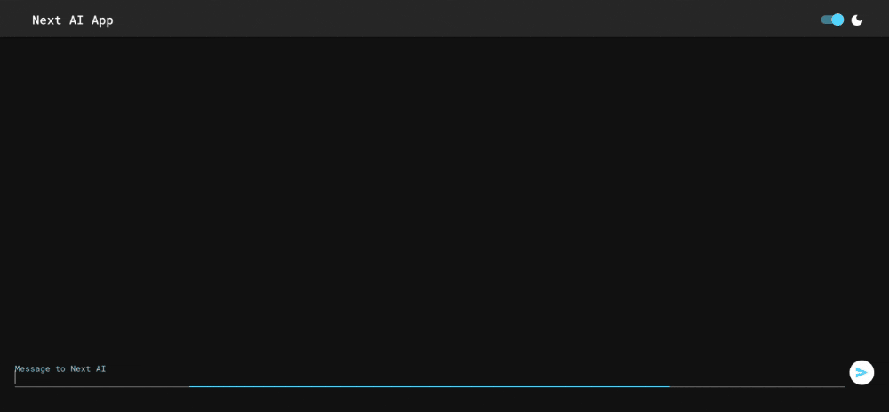

# Next AI App


<br/>
<br/>
Next AI App is a web application powered by Next.js and the OpenAI API, designed to facilitate engaging and dynamic text-based conversations with an AI chatbot. This project leverages server-side rendering provided by Next.js to ensure optimal performance and user experience. The integration with the OpenAI API enables the AI chatbot to generate human-like responses and engage in meaningful conversations with users.

## Technologies Used

- Next.js: Server-side rendering, routing, and optimized performance.

- OpenAI API: Cutting-edge natural language processing capabilities.

- React: Modular and component-based user interface development.

- Material-UI: Component library for styling and building user interfaces in React applications.

- CSS: Additional styling for customizing Material-UI components and enhancing user experience.

## Getting Started

If you don't have an OpenAI API key yet you should create one. Go to this link for more information: https://platform.openai.com/docs/quickstart?context=node

1. Clone the repository:

```
git clone https://github.com/Stomari/next-ai-test.git
```

2. Install dependencies:

```
cd next-ai-test
npm install
```

3. Set up your environment variables.
   Create a **.env.local** file in the root directory of the project and add your OpenAI API key:

```
OPENAI_API_KEY=your_openai_api_key
```

4. Run the development server:

```
npm run dev
```

Open your browser and navigate to http://localhost:3000 to view the app.
